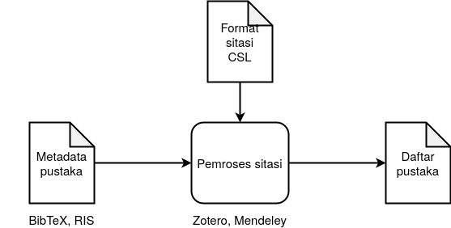

# Citation Style Language untuk Format PPKI IPB

Download CSL: [ipb.link/csl](https://auriza.github.io/csl-ipb/ipb.csl)

## *Best practice* penulisan metadata pustaka

| Komponen              | Penulisan                                                                |
|:----------------------|:-------------------------------------------------------------------------|
| Judul buku            | *title case*                                                             |
| Nama jurnal/prosiding | *title case*                                                             |
| Judul artikel         | *sentence case*                                                          |
| Penulis tidak ada     | pada atribut `Short Title`: kata pertama dari judul                      |
| Penulis organisasi    | langsung singkatannya saja (belum didukung)                              |
| Jenis artikel         | pada atribut `Extra` (Zotero) atau `note` (BibTeX): editorial, ulasan, … |

## Contoh Keluaran

Hasil uji coba: [HTML](https://auriza.github.io/csl-ipb/test/ppki4.html), [PDF](https://auriza.github.io/csl-ipb/test/ppki4.pdf)

Contoh paper: [HTML](https://auriza.github.io/csl-ipb/tesis/paper.html), [PDF](https://auriza.github.io/csl-ipb/tesis/paper.pdf)
