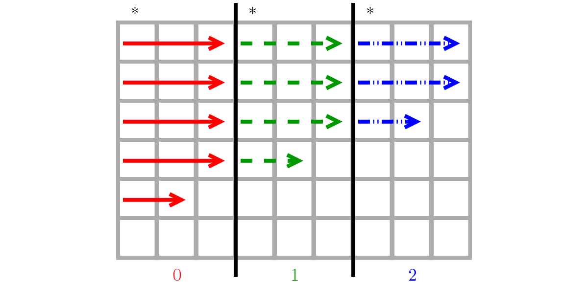
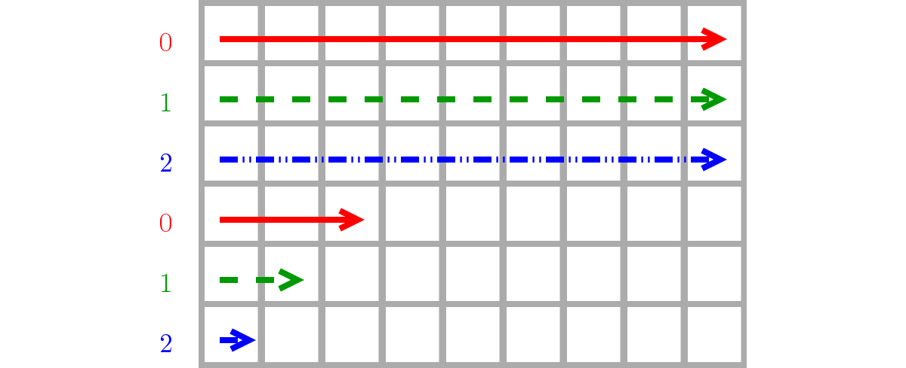
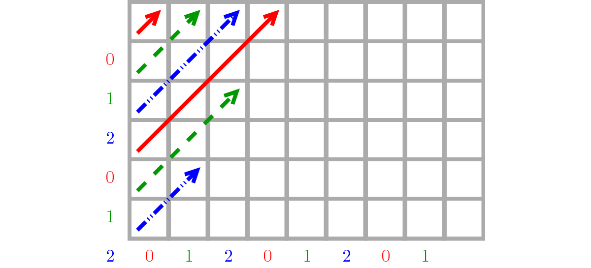
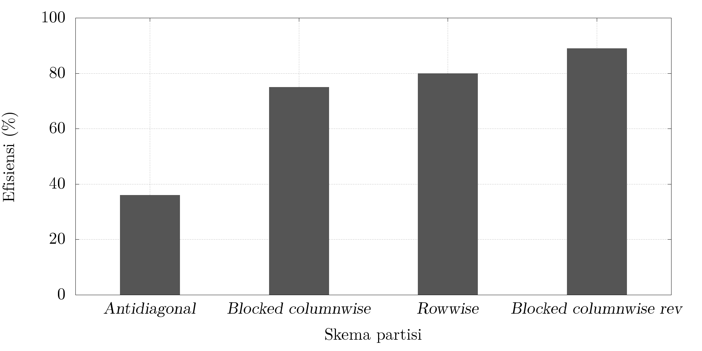

<!-- Perbandingan efisiensi paralel skema partisi data algoritme Pairwise Alignment pada sistem multi-core-->
<!-- write paper to communicate your ideas -->

\begin{abstract}
Algoritme \emph{pairwise alignment} (PA) banyak digunakan pada bidang bioinformatika untuk analisis sekuens biologis.
Seiring dengan berkembangnya teknologi \emph{sequencer}, data sekuens yang dihasilkan semakin berlimpah.
Oleh karena itu, algoritme PA perlu diparalelkan agar dapat memproses banyak data dalam waktu yang singkat.
Beberapa penelitian telah memparalelkan algoritme PA dengan berbagai skema partisi data.
Penelitian ini bertujuan untuk mendapatkan skema partisi data yang menghasilkan kinerja terbaik pada arsitektur \emph{shared memory}.
Skema partisi yang dibandingkan antara lain: \emph{blocked columnwise}, \emph{rowwise}, dan antidiagonal.
Algoritme PA diparalelkan menggunakan pustaka OpenMP.
Di luar perkiraan, skema partisi \emph{rowwise} menghasilkan kinerja terbaik sementara dengan efisiensi 80\%.
Setelah beberapa perbaikan, skema partisi \emph{blocked columnwise} akhirnya memberikan kinerja terbaik dengan efisiensi 89\%.
\end{abstract}

# Pendahuluan

Algoritme *pairwise alignment* (PA) dipakai dalam bioinformatika untuk menjajarkan sepasang sekuens DNA.
Hasil penjajaran digunakan untuk menentukan kemiripan antara keduanya [@cohen2004].
PA menggunakan teknik pemrograman dinamis untuk memperoleh hasil penjajaran optimal dengan kompleksitas $O(L^2)$, dengan $L$ sebagai panjang sekuens [@waterman1976].
PA merupakan penyusun dasar algoritme *multiple sequence alignment* (MSA) yang digunakan untuk menjajarkan lebih dari dua sekuens sekaligus.
Contoh aplikasi yang menggunakan algoritme ini ialah `clustalw` [@thompson1994], `t-coffee` [@notredame2000], `mafft` [@katoh2002], dan `muscle` [@edgar2004].
Selain itu, PA juga dipakai untuk pencarian sekuens pada *database*, untuk menemukan sekuens-sekuens yang paling mirip dengan sekuens yang dicari [@rognes2000].

Teknologi *next-generation DNA sequencer* terkini menghasilkan data sekuens yang banyak, hingga 600 Gb sekali jalan [@liu2012].
Data yang besar memerlukan pemrosesan yang cepat, sehingga algoritme penjajaran perlu diparalelkan untuk mempercepat proses analisis.
Paralelisasi MSA telah banyak dilakukan, seperti pada `praline` [@kleinjung2002], `clustalw-mpi` [@li2003], `mt-clustalw` [@chaichoompu2006], dan `mafft` [@katoh2010].
Paralelisasi PA juga telah dilakukan meskipun tidak sebanyak MSA, seperti `paralign` [@rognes2001] dan `cudasw` [@liu2013] .

Terdapat dua jenis algoritme PA, yaitu penjajaran global [@needleman1970] dan penjajaran lokal [@smith1981].
Teknik pemrograman dinamis pada PA menyebabkan adanya dependensi data, sehingga metode partisi data sangat berpengaruh pada kinerja algoritme.
Metode partisi yang telah diterapkan untuk paralelisasi PA antara lain: *columnwise* [@hughey1996], diagonal [@rognes2001], *rowwise* [@martins2001], *blocked columnwise* [@liu2003], dan *blocked* anti-diagonal [@li2012].
Namun demikian, belum diketahui metode partisi mana yang memberikan kinerja terbaik pada arsitektur *shared memory*.

Tujuan penelitian ini adalah memparalelkan algoritme PA pada arsitektur *shared memory* menggunakan OpenMP dan membandingkan skema partisi data yang memberikan kinerja terbaik.

# Metode Penelitian

Algoritme PA diimplementasikan terlebih dahulu secara sekuensial dengan pendekatan penjajaran global.
Keluaran program dibandingkan dengan keluaran `clustalw` untuk verifikasi kebenaran algoritme ini.
Proses verifikasi menggunakan masukan data dua sekuens Hemoglobin $\alpha$ dan $\beta$ kuda (*Equus caballus*).

Setelah verifikasi berhasil, yaitu hasil penjajaran sudah benar, barulah dikembangkan algoritme PA secara paralel.
Kinerja algoritme diuji dengan membangkitkan data sekuens DNA dengan panjang yang bervariasi, yaitu 1000, 2000, 4000, 8000, dan 16000 pasang basa.

Paralelisasi diimplementasikan dengan pustaka OpenMP, yang jauh lebih mudah daripada jika menggunakan instruksi prosesor MMX/SSE [@rognes2001] maupun pustaka Pthreads [@chaichoompu2006;@katoh2010].
OpenMP adalah pustaka untuk memparalelkan program secara *multithreading* pada arsitektur *shared memory* [@dagum1998].
Hasil penjajaran program paralel dibandingkan dengan program sekuensial, keluarannya harus sama untuk menjamin konsistensi sekuensial [@lamport1979].

Terdapat tiga skema partisi data program paralel yang diuji, yaitu skema *blocked columnwise*, *rowwise*, dan anti diagonal.
Hasil penjajaran dari ketiga skema tersebut juga diuji untuk mengetahui validasi keluaran.
Waktu eksekusi program paralel dari ketiga skema tersebut dibandingkan untuk menentukan skema partisi yang terbaik.

Penghitungan waktu eksekusi dilakukan pada prosesor Intel Core i5 yang memiliki 4 *core*.
Waktu eksekusi didapat menggunakan fungsi `omp_get_wtime()` dari pustaka OpenMP.
Waktu yang dihitung adalah waktu untuk menghitung matriks penjajaran.
Penghitungan waktunya diulang sebanyak 10 kali untuk setiap panjang sekuens dan skema partisi yang berbeda.
Waktu yang didapat kemudian diambil rataannya sebagai hasil akhir waktu eksekusi.

# Hasil dan Pembahasan

## Implementasi algoritme *pairwise alignment* sekuensial

Implementasi algoritme PA dikembangkan dari algoritme *longest common subsequence* (LCS) [@cormen2009] dengan beberapa modifikasi.
LCS adalah algoritme penjajaran global yang lebih dikenal dengan sebutan algoritme Needleman--Wunsch [@needleman1970].
Skor penjajaran diatur sehingga jika penjajaran *match* maka skor bertambah 1, sebaliknya jika *mismatch* atau *gap* maka skor berkurang 1.
Untuk baris dan kolom ke--0, inisialisasi nilai awal pada matriks penjajaran diatur menurun, yaitu $-1$ dikali jaraknya dari titik awal (pojok kiri atas).
Berikut adalah implementasi algoritme PA dalam bahasa pemrograman C untuk menjajarkan sekuens $X$ dan $Y$.

~~~c
#define MATCH       +1
#define MISMATCH    -1
#define GAP         -1

/* initialization */
C[m+1][n+1] = {{EMPTY}};    					// score matrix
for (i = 0; i <= m; i++) C[i][0] = i*GAP;		// 0th col setup
for (j = 0; j <= n; j++) C[0][j] = j*GAP;		// 0th row setup

time = omp_get_wtime();             			// start time

/* alignment score computation	*/
for (i = 1; i <= m; i++) {
    for (j = 1; j <= n; j++) {

        /* calculate three possible directions  */
        diag = C[i-1][j-1] + ((X[i] == Y[j])? MATCH : MISMATCH);
        up   = C[i-1][ j ] + GAP;
        left = C[ i ][j-1] + GAP;

        /* choose one with the biggest score    */
        if (diag >= up && diag >= left)	 C[i][j] = diag;
				   else if (up >= left)	 C[i][j] = up;
								   else	 C[i][j] = left;
    }
}

time = omp_get_wtime() - time;      			// end time
~~~

Contoh perhitungan matriks penjajaran global dapat dilihat pada Gambar \ref{nw}, yang menjajarkan sekuens `AGTCA` dan `ATGA` dengan hasil skor 1 (nilai sel pada pojok kanan bawah) dan hasil penjajaran sebagai berikut.

								   AGTCA
								   A-TGA

## Verifikasi hasil penjajaran

Hasil penjajaran sekuens dibandingkan dengan keluaran dari program `clustalw` dengan opsi `-dnamatrix=clustalw -gapopen=1 -gapext=1 -endgaps`.
Skor penjajaran dihitung dengan aturan jika penjajaran *match* maka skor bertambah 1, namun jika *mismatch* skor berkurang 1.
Secara umum algoritme PA yang dikembangkan sudah benar, kedua sekuens berhasil dijajarkan.

Namun setelah diamati, program `clustalw` menghasilkan penjajaran dengan jumlah *gap* lebih sedikit dan posisinya lebih mengumpul.
Hal ini dikarenakan program `clustalw` memiliki lebih banyak opsi dan fitur, serta perbaikan bertahun-tahun untuk menghasilkan penjajaran yang akurat.
Berikut <!-- dan Gambar \ref{compare} --> adalah perbandingan keluaran kedua program penjajaran pada sekuens Hemoglobin $\alpha$ dan $\beta$ kuda (*Equus caballus*).

    > clustalw
    HbA   ATCATCC-TAACAGAGTTTACAATGACAACCGGCTGTTGTAAACAATGGCTAT..
    HbB   -TCGTTCGTCTCACTACCTCCAGTTCGCTGTACCTCTATTGAGTAGTGG-TAC..

    > PA sekuensial
    HbA   ATC-ATC--CT-A--A-C-AGAGTTTACAATGACAACCGGCTGTTGTAAACAATGGCTAT..
    HbB   -TCGTTCGTCTCACTACCTCCAG-TT-CGCTG--TACC-TCTATTG--AGTAGTGG-TAC..

Berdasarkan hasil penjajaran di atas, algoritme PA sekuensial sederhana telah berhasil diimplementasikan.
Hasil penghitungan waktu eksekusi dapat dilihat pada Tabel \ref{t.seq}.
Selanjutnya, algoritme ini akan menjadi dasar untuk diparalelkan.

Panjang sekuens (bp)      Waktu (s)
--------------------    -------------
     1000               0.017
     2000               0.052
     4000               0.203
     8000               0.815
    16000               3.250

Table: Waktu eksekusi algoritme PA sekuensial pada Intel Core i5.\label{t.seq}

## Skema partisi *blocked columnwise*

Skema partisi ini membagi matriks penjajaran per blok kolom [@liu2003].
*Thread* ke-$i$ ($t_i$) mendapat bagian satu blok dari kolom ke-$(\lceil \frac {i \cdot n} t \rceil + 1)$ sampai $(\lceil \frac {(i+1)\, n} t \rceil)$, dengan $n$ banyaknya kolom dan $t$ banyaknya *thread*.
Misalnya $n$ = 9 dan $t$ = 3, maka $t_0$ mendapat bagian blok kolom ke-1--3.
Ilustrasi skema ini dapat dilihat pada Gambar \ref{bcol}.

Skema *blocked columnwise* membutuhkan waktu komunikasi---atau dalam *shared memory* ialah dependensi data antar-*thread*---yang sedikit.
Sel pada kolom paling depan (tanda *) mengecek apakah sel di sebelah kirinya sudah terisi oleh *thread* lain atau belum.
Jika salah satu *thread* kerjanya lebih lambat, maka *thread* berikutnya harus menunggu sampai *thread* pertama menyelesaikan satu baris bagiannya.

Namun, pemakaian direktif `for` pada OpenMP walaupun sederhana tetapi kurang fleksibel, sehingga pengecekan masih dilakukan untuk tiap sel.
Hal ini menyebabkan penurunan kinerja karena algoritme paralel menjadi kurang efisien.
Berikut baris kode yang telah ditambahkan direktif OpenMP untuk memparalelkan algoritme PA dengan skema ini.

~~~c
#pragma omp parallel private(i,diag,up,left)
for (i = 1; i <= m; i++) {

    #pragma omp for schedule(static) nowait
    for (j = 1; j <= n; j++) {

        /* wait until its left cell is filled   */
        while (C[i][j-1] == EMPTY);

        /* calculate three possible directions,
           choose one with the biggest score    */
        ...
    }
}
~~~

Hasil penghitungan waktu eksekusi untuk skema *blocked columnwise* menunjukkan *speedup* sampai 3 kali lipat dibanding algoritme sekuensial.
Nilai *speedup* masih belum optimal pada sekuens yang pendek.
Seiring dengan bertambahnya panjang sekuens nilai *speedup* stabil pada angka 3.00.
Efisiensi (nilai *speedup* dibanding jumlah *thread*) yang didapat sebesar 75% untuk jumlah *thread* 4.
Hasil lengkapnya dapat dilihat pada Tabel \ref{t.bcol}.

Panjang sekuens (bp)     Waktu sekuensial (s)    Waktu paralel (s)   *Speedup*
--------------------    ----------------------  ------------------- -----------
1000                    0.017                   0.007               2.31
2000                    0.052                   0.019               2.75
4000                    0.203                   0.068               2.99
8000                    0.815                   0.273               2.98
16000                   3.250                   1.084               3.00

Table: Waktu eksekusi PA paralel skema *blocked columnwise* dengan 4 *thread*.\label{t.bcol}

## Skema partisi *rowwise*

Skema partisi *rowwise* membagi matriks penjajaran per baris [@martins2001].
*Thread* ke-$i$ ($t_i$) mendapatkan bagian baris ke-$(i + xt + 1)$, dengan $x = 0, 1, 2, ..., (\lceil\frac{m}{t}\rceil - 1)$, $m$ banyaknya baris, dan $t$ jumlah *thread*.
Misalnya banyaknya baris $m$ = 12 dan jumlah *thread* $t$ = 3, maka $t_0$ mendapat bagian baris ke-1, 4, 7, dan 10.
Ilustrasi skema ini dapat dilihat pada Gambar \ref{row}.

Skema *rowwise* memiliki dependensi data antar-*thread* (komunikasi) yang tinggi, yaitu pada setiap iterasi.
Setiap sel harus mengecek sel di atasnya sudah terisi oleh *thread* lain atau belum.
Meskipun demikian, hal tersebut tidak menurunkan kinerja karena implementasi dilakukan pada arsitektur *shared memory*.
Berikut baris kode yang telah ditambahkan direktif OpenMP untuk memparalelkan algoritme PA dengan skema ini.

~~~c
#pragma omp parallel for schedule(static,1) private(j,diag,up,left)
for (i = 1; i <= m; i++) {
    for (j = 1; j <= n; j++) {

        /* wait until its upper cell is filled   */
        while (C[i-1][j] == EMPTY);

        /* calculate three possible directions,
           choose one with the biggest score    */
        ...
    }
}
~~~

Di luar dugaan, hasil penghitungan waktu eksekusi untuk skema *rowwise* menunjukkan *speedup* sampai 3.18 kali lipat, melebihi *speedup* skema *blocked columnwise*.
Nilai *speedup* masih terlihat belum optimal pada sekuens yang pendek.
Seiring dengan bertambahnya panjang sekuens nilai *speedup* mencapai angka 3.18.
Efisiensi yang didapat dari penggunaan skema *rowwise* ini sebesar 80% untuk jumlah *thread* 4.
Hasil lengkapnya dapat dilihat pada Tabel \ref{t.row}.

Panjang sekuens (bp)     Waktu sekuensial (s)    Waktu paralel (s)   *Speedup*
--------------------    ----------------------  ------------------- -----------
1000                    0.017                   0.008               2.20
2000                    0.052                   0.018               2.94
4000                    0.203                   0.065               3.15
8000                    0.815                   0.258               3.16
16000                   3.250                   1.022               3.18

Table: Waktu eksekusi PA paralel skema *rowwise* dengan 4 *thread*.\label{t.row}

## Skema partisi antidiagonal

Skema partisi antidiagonal membagi matriks penjajaran per antidiagonal, melintang dari kiri-bawah ke kanan-atas [@li2012].
*Thread* ke-$i$ ($t_i$) mendapatkan bagian antidiagonal ke-$(i + xt + 1)$, dengan $x = 0, 1, 2, ..., (\lceil \frac{m+n-1}{t} \rceil -1)$, $m$ banyaknya baris, $n$ banyaknya kolom, dan $t$ jumlah *thread*.
Misalnya banyak baris $m$ = 6, banyak kolom $n$ = 10, dan jumlah *thread* $t$ = 3, maka $t_0$ mendapat bagian antidiagonal ke-1, 4, 7, 10, dan 13.
Ilustrasi skema ini dapat dilihat pada Gambar \ref{adiag}.

Skema antidiagonal memiliki dependensi data antar-*thread* (komunikasi) yang tinggi, yaitu pada setiap iterasi.
Setiap sel harus mengecek apakah sel di kiri dan atasnya sudah terisi oleh *thread* lain atau belum.
Berbeda dengan skema *rowwise*, pola akses memori yang nonlinier membuat kinerja skema antidiagonal lebih buruk.
Berikut baris kode yang telah ditambahkan direktif OpenMP untuk memparalelkan algoritme PA dengan skema ini.

~~~c
#pragma omp parallel for schedule(static,1) private(i,j,diag,up,left)
for (k = 1; k <= m+n; k++) {

    /* upper diagonal   */
    if (k < m)
        for (i = k, j = 1; i > 0 && j <= n; i--, j++) {

            /* wait until its left and upper cell is filled   */
            while (C[i][j-1] == EMPTY || C[i-1][j] == EMPTY);

            /* calculate three possible directions,
               choose one with the biggest score    */
            ...
        }

    /* lower diagonal   */
    else if (k > m)
        for (i = m, j = k-m; i > 0 && j <= n; i--, j++) {

            /* wait until its left and upper cell is filled   */
            while (C[i][j-1] == EMPTY || C[i-1][j] == EMPTY);

            /* calculate three possible directions,
               choose one with the biggest score    */
            ...
        }
}
~~~

Hasil penghitungan waktu eksekusi untuk skema antidiagonal menunjukkan *speedup* sampai 1.44 kali lipat dibanding dengan algoritme sekuensial.
Efisiensi yang didapat pada skema ini hanya sebesar 36% untuk jumlah *thread* 4, jauh di bawah dua skema lainnya.
Hasil lengkapnya dapat dilihat pada Tabel \ref{t.adiag}.

Panjang sekuens (bp)     Waktu sekuensial (s)    Waktu paralel (s)   *Speedup*
--------------------    ----------------------  ------------------- -----------
1000                    0.017                   0.013               1.28
2000                    0.052                   0.037               1.43
4000                    0.203                   0.145               1.40
8000                    0.815                   0.563               1.45
16000                   3.250                   2.255               1.44

Table: Waktu eksekusi PA paralel skema antidiagonal dengan 4 *thread*.\label{t.adiag}

## Skema partisi *rowwise* lebih baik?

Terlihat bahwa kinerja skema *rowwise* lebih baik daripada *blocked columnwise* dengan efisiensi 80% dan 75% berturut-turut pada 4 *thread*.
Hasil tersebut di luar dugaan, karena skema *rowwise* memerlukan pengecekan dependensi data antar-*thread* yang lebih banyak.
Hal ini disebabkan karena implementasi dilakukan pada arsitektur *shared memory*, sehingga waktu komunikasi perpindahan data dapat diabaikan karena tiap *thread* mengakses memori yang sama.
Hasilnya akan jauh berbeda jika diimplementasikan pada arsitektur *distributed memory*.
Selain itu, algoritme *blocked columnwise* di atas dinilai belum optimal, karena pengecekan dependensi data terjadi pada setiap iterasi.
Untuk mengatasi hal tersebut, pembagian data perlu dilakukan secara manual tanpa bantuan OpenMP.

Hasil yang berbeda didapatkan pada skema antidiagonal yang menghasilkan kinerja terburuk, yaitu efisiensi 36% pada 4 *thread*.
Hasil tersebut disebabkan karena pola akses memori yang nonlinier, sehingga banyak terjadi *cache miss*.

## Perbaikan skema partisi *blocked columnwise*

### Pembagian *looping* manual

Perbaikan pertama adalah pembagian *looping* secara manual tanpa bantuan *construct* `for` dari OpenMP.
Hal ini disebabkan karena *construct* tersebut walaupun memudahkan tetapi kurang fleksibel untuk kasus tertentu.
Pengecekan dependensi data akan dilakukan sekali per baris oleh tiap *thread*, sehingga diharapkan dapat meningkatkan kinerja.
Berikut potongan kode yang telah diubah dengan pembagian *looping* secara manual.

~~~c
#pragma omp parallel private(i,j,diag,left,up)
{
	/* manual worksharing setup	*/
    int id     = omp_get_thread_num();
    int nthrds = omp_get_num_threads();
	int chunk  = n/nthrds;
    int jfirst = chunk*id + 1;
    int jlast  = (id < np-1)? chunk*(id+1) : n;

    for (i = 1; i <= m; i++) {

        /* wait until leftmost cell is filled   */
        while (C[i][jfirst-1] == EMPTY);

        for (j = jfirst; j <= jlast; j++) {
            /* calculate three possible directions,
               choose one with the biggest score    */
            ...
        }
    }
}
~~~

Tabel \ref{t.bcol-manual} menunjukkan hasil penghitungan waktu eksekusi untuk skema *blocked columnwise* dengan *looping* manual yang mencapai *speedup* sampai 3.16 kali lipat dibanding dengan algoritme sekuensial.
Efisiensi yang didapat dengan *looping* manual meningkat menjadi sebesar 79% untuk jumlah *thread* 4, hampir menyamai skema *rowwise*.
Capaian ini akan diperbaiki lebih lanjut dengan teknik *loop unrolling* dengan harapan *speedup* yang didapat lebih maksimal.

Panjang sekuens (bp)     Waktu sekuensial (s)    Waktu paralel (s)   *Speedup*
--------------------    ----------------------  ------------------- -----------
1000                    0.017                   0.008               2.18
2000                    0.052                   0.018               2.91
4000                    0.203                   0.065               3.15
8000                    0.815                   0.259               3.15
16000                   3.250                   1.027               3.16

Table: Waktu eksekusi PA paralel skema *blocked columnwise* *looping* manual dengan 4 *thread*.\label{t.bcol-manual}

### *Loop unrolling*

Perbaikan berikutnya adalah dengan menggunakan teknik *loop unrolling*, yaitu menggabungkan beberapa iterasi menjadi satu.
Teknik ini bertujuan untuk mengurangi jumlah instruksi dan meningkatkan *cache locality* [@loveman1977; @sedgewick1978].
*Looping* untuk setiap baris akan di-*unroll* dengan faktor dua, yaitu iterasi untuk dua baris akan digabung menjadi satu.
Hal ini dilakukan dengan membuat dua salinan *looping* untuk $C_{i,j}$ dan $C_{(i+1),j}$ dengan *increment* sebesar 2 untuk tiap iterasi.

Berikut potongan kode yang telah diubah menggunakan *loop unrolling* dengan faktor dua.
Terdapat pengecekan yang ditambahkan di tengah *looping* agar *looping* berhenti jika sudah mencapai baris terakhir.
Pengecekan tersebut merupakan antisipasi jika jumlah baris $m$ tidak tepat habis dibagi dengan faktor *unroll*.

~~~c
#pragma omp parallel private(i,j,diag,left,up)
{
	/* manual worksharing setup	*/
    ...

    for (i = 1; i <= m; i += 2) {

        /* wait until leftmost cell is filled   */
        while (C[i][jfirst-1] == EMPTY);

        for (j = jfirst; j <= jlast; j++) {
            /* calculate three possible directions,
			   choose one with the biggest score for C[i][j]   */
            ...

            if (i == m)	break;

            /* calculate three possible directions,
               choose one with the biggest score for C[i+1][j] */
            ...
        }
    }
}
~~~

Tabel \ref{t.bcol-manual-unroll} menunjukkan hasil penghitungan waktu eksekusi untuk skema *blocked columnwise* dengan *looping* manual dan *loop unrolling* faktor dua yang memberikan *speedup* sampai 3.54 kali lipat dibanding dengan algoritme sekuensial.
Efisiensi yang didapat meningkat menjadi sebesar 89% untuk jumlah *thread* 4.

Panjang sekuens (bp)     Waktu sekuensial (s)    Waktu paralel (s)   *Speedup*
--------------------    ----------------------  ------------------- -----------
1000                    0.017                   0.006               2.56
2000                    0.052                   0.017               3.16
4000                    0.203                   0.058               3.51
8000                    0.815                   0.231               3.53
16000                   3.250                   0.918               3.54

: Waktu eksekusi PA paralel skema *blocked columnwise* *looping* manual dan *loop unrolling* dengan 4 *thread*.\label{t.bcol-manual-unroll}

## Perbandingan kinerja

Skema *blocked columnwise* yang telah diperbaiki menghasilkan kinerja yang lebih baik dibandingkan skema *rowwise*, dengan efisiensi mencapai 89% pada jumlah *thread* 4.
Perbandingan kinerja skema partisi data yang telah diuji dapat dilihat pada Gambar \ref{efisiensi}.

# Simpulan dan Saran

Algoritme PA dengan skema partisi *blocked columnwise* yang telah diperbaiki menghasilkan kinerja tertinggi (efisiensi 89%).
Di luar perkiraan, skema partisi *rowwise* menghasilkan kinerja yang cukup bagus (efisiensi 80%) pada arsitektur *shared memory*.

Penelitian ini menghasilkan algoritme PA dengan *fine-grain parallelism* yang dapat dimanfaatkan lebih lanjut sebagai komponen untuk mengembangkan algoritme MSA paralel pada arsitektur hibrida *shared--distributed memory* dengan memakai OpenMP--MPI.

# Ucapan Terima Kasih

Penelitian ini terlaksana berkat bantuan dana dari Kerjasama Kemitraan Penelitian dan Pengembangan Pertanian Nasional (KKP3N) Kementerian Pertanian Indonesia tahun 2013.
Ucapan terima kasih penulis ucapkan kepada Dr Wisnu Ananta Kusuma yang telah mengikutsertakan penulis dalam kerjasama penelitian tersebut.

# Daftar Pustaka

<!-- \input{pa-partition.ref.tex} -->

